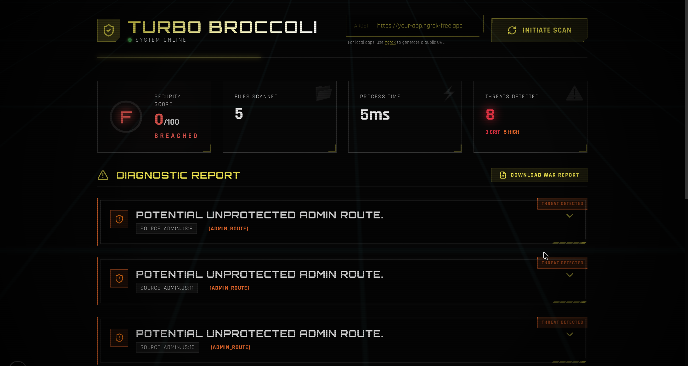

<p align="center">
  <h1 align="center">🥦 Turbo Broccoli</h1>
  <p align="center">
    <strong>Hybrid SAST + DAST Security Scanner for Modern Web Applications</strong>
  </p>
  <p align="center">
    <em>"If I were an attacker, how would I break this app?"</em><br/>
    <em>Turbo Broccoli tells you the answer before you ship.</em>
  </p>
</p>

---



---
## Overview


Turbo Broccoli is a **pre-deployment security guardrail** designed for developers, students, and early-stage startups who need to catch critical vulnerabilities before they go live. It combines **Static Application Security Testing (SAST)** with **Dynamic Application Security Testing (DAST)** to provide comprehensive security coverage.

### The Problem

Teams often ship fast and break rules. Common mistakes include:
-  Committing `.env` files or API keys to version control
-  Misconfiguring JWTs (using `none` algorithm or weak secrets)
-  Leaving CORS wide open (`*`)
-  Exposing admin routes without proper protection
-  Missing `.gitignore` coverage for sensitive files

Turbo Broccoli acts as a **last-mile security checkpoint** that catches these issues, explains how to exploit them, and offers AI-powered fix suggestions.

---

## Features

### Static Analysis (SAST)
| Feature | Description |
|---------|-------------|
| **Regex-based Rules** | Pattern matching for secrets, misconfigurations, and vulnerabilities |
| **AST-based Analysis** | Deep code understanding using TypeScript-ESTree parser |
| **Multi-pattern Detection** | AWS keys, JWT tokens, API secrets, hardcoded credentials |

###  Dynamic Analysis (DAST)
| Feature | Description |
|---------|-------------|
| **Live Endpoint Testing** | Verifies vulnerabilities against running applications |
| **Security Headers Check** | Validates presence of critical HTTP security headers |
| **Git Exposure Detection** | Checks for exposed `.git` directories |
| **Admin Route Verification** | Tests for unprotected administrative endpoints |

### Additional Features
- **AI-Powered Fix Suggestions** — Get intelligent remediation code using Google Gemini
- **Security Score Dashboard** — Visual representation of your security posture
- **Severity Classification** — Issues ranked as CRITICAL, HIGH, MEDIUM, or LOW
- **Cyberpunk UI** — Premium developer-friendly interface with modern aesthetics

---

##  Architecture

```
turbo-broccoli/
├── src/
│   ├── app/                   
│   │   ├── api/
│   │   │   ├── fix/            
│   │   │   └── scan-dynamic/  
│   │   ├── components/        
│   │   └── page.tsx           
│   ├── scanner/
│   │   ├── Scanner.ts         
│   │   └── DynamicScanner.ts  
│   ├── rules/
│   │   ├── ast/               
│   │   │   ├── dangerousEval.ts
│   │   │   ├── sqlInjection.ts
│   │   │   └── unsafeObjectAccess.ts
│   │   ├── dynamic/           
│   │   │   ├── gitExposure.ts
│   │   │   ├── securityHeaders.ts
│   │   │   └── verifyAdminRoute.ts
│   │   ├── exposedSecrets.ts
│   │   ├── jwtMisconfiguration.ts
│   │   ├── brokenCors.ts
│   │   ├── adminRoutes.ts
│   │   └── gitignoreValidation.ts
│   ├── ast/                   
│   ├── services/              
│   └── types.ts               
└── public/                    
```

---

## Tech Stack

| Category | Technologies |
|----------|-------------|
| **Frontend** | Next.js 16, React 19, TailwindCSS 4, Lucide Icons |
| **Backend** | Node.js, Next.js API Routes |
| **Analysis** | TypeScript-ESTree, Acorn AST Parser, Regex |
| **AI Integration** | Google Generative AI (Gemini) |
| **HTTP Client** | Axios |
| **Authentication** | jsonwebtoken (for JWT analysis) |

---

## Getting Started

### Prerequisites

- Node.js 18+ 
- npm or yarn
- Google AI API key for fix suggestions

### 1. Installation

```bash
git clone https://github.com/vedant44-cyber/turbo-broccoli.git
cd turbo-broccoli
npm install
```

### 2. Configuration

Create a `.env` file from the example:

```bash
cp .env.example .env
```

Add your Google AI API key  

```env
GEMINI_API_KEY=your_api_key_here
```

### 3. Run the Dashboard

```bash
npm run dev
```

Open [http://localhost:3000](http://localhost:3000) in your browser.

---

## Usage

### Static Scan (SAST)

1. **Open Dashboard** — Navigate to `http://localhost:3000`
2. **Upload Files** — Drag and drop your project folder or select files
3. **Run Scan** — Click the **"INITIATE SCAN"** button
4. **Review Results** — Vulnerabilities are displayed with severity, code snippets, and fix suggestions

### Dynamic Scan (DAST)

1. **Enter Target URL** — Input your running application's public URL
   - For local apps, use [ngrok](https://ngrok.com) to expose your app
2. **Run Dynamic Scan** — The scanner will test live endpoints
3. **Review Findings** — Dynamic vulnerabilities appear alongside static findings

---

## Security Rules

### Static Rules (Regex + AST)

| Rule ID | Name | Severity | Description |
|---------|------|----------|-------------|
| `exposed-secrets` | Exposed Secrets | CRITICAL | Detects AWS keys, API tokens, database URLs |
| `jwt-misconfiguration` | JWT Misconfiguration | CRITICAL | Finds weak signing, `none` algorithm usage |
| `broken-cors` | Broken CORS | HIGH | Identifies overly permissive CORS policies |
| `admin-routes` | Admin Routes | MEDIUM | Flags unprotected admin endpoints |
| `gitignore-validation` | Gitignore Validation | HIGH | Checks for missing `.gitignore` entries |
| `dangerous-eval` | Dangerous Eval | CRITICAL | AST detection of `eval()` and `Function()` |
| `sql-injection` | SQL Injection | CRITICAL | AST detection of injectable queries |
| `unsafe-object-access` | Unsafe Object Access | HIGH | AST detection of bracket notation with user input |

### Dynamic Rules

| Rule ID | Name | Description |
|---------|------|-------------|
| `security-headers` | Security Headers | Checks for missing CSP, X-Frame-Options, etc. |
| `git-exposure` | Git Exposure | Detects exposed `.git` directories |
| `verify-admin-route` | Admin Route Verification | Tests if admin endpoints are accessible |

---

## Scripts

| Command | Description |
|---------|-------------|
| `npm run dev` | Start development server |
| `npm run build` | Build for production |
| `npm run start` | Start production server |
| `npm run lint` | Run ESLint |

---


## License

This project is open source and available under the [MIT License](LICENSE).

---


<p align="center">
  Made with 💚 for developers who care about security
</p>
